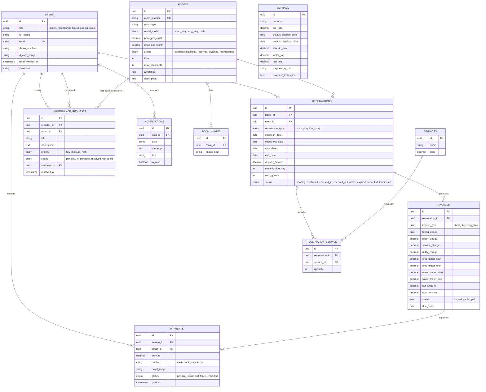

# Sonita Guest House — Entity-Relationship Diagram

Generated directly from the actual Laravel migrations in `database/migrations/` (not hand-drawn),
so it always matches what's really in the database. Covers the 11 domain tables; Laravel/Fortify
infrastructure tables (`sessions`, `cache`, `jobs`, `password_reset_tokens`, `passkeys`) are
omitted since they aren't part of the application's own data model.

## Diagram

## Notes

- All primary keys are **UUIDs** (`HasUuids`), not auto-incrementing integers — a deliberate
  choice to prevent ID-guessing/enumeration on public-facing records.
- `RESERVATION_SERVICE` is a genuine junction table (with its own `id`, plus `quantity`) resolving
  the many-to-many between `RESERVATIONS` and `SERVICES` — not a simple pivot without a model.
- `MAINTENANCE_REQUESTS` has **two** relationships to `USERS`: `reporter_id` (who filed it) and
  `assigned_to` (which housekeeping staff it's assigned to, nullable until an admin assigns it).
- `SETTINGS` is a singleton table (the app expects exactly one row) and has no foreign keys — it
  holds business-wide configuration (currency, tax rate, utility billing rates, etc.), not
  per-record data.
- `id_card_image` on `USERS` and `email_verified_at`/`password`/`remember_token` are omitted from
  the diagram's enum/type annotations above where not relevant to the data model, but are present
  in the actual table (see `database/migrations/0001_01_01_000000_create_users_table.php`).

## Column reference

### Identity & access

**users** — `id` PK · `role` enum(admin/receptionist/housekeeping/guest) · `full_name` ·
`email` UK · `phone_number` · `id_card_image` · `email_verified_at` · `password` ·
`remember_token` · timestamps

### Property

**rooms** — `id` PK · `room_number` UK · `room_type` · `rental_mode` enum(short_stay/long_stay/both) ·
`price_per_night` · `price_per_month` · `status` enum(available/occupied/reserved/cleaning/maintenance) ·
`floor` · `max_occupants` · `amenities` · `description` · timestamps

**room_images** — `id` PK · `room_id` FK → rooms · `image_path` · timestamps

### Reservations

**reservations** — `id` PK · `guest_id` FK → users · `room_id` FK → rooms ·
`reservation_type` enum(short_stay/long_stay) · `check_in_date` · `check_out_date` ·
`start_date` · `end_date` · `deposit_amount` · `monthly_due_day` · `num_guests` ·
`status` enum(pending/confirmed/checked_in/checked_out/active/expired/cancelled/terminated) ·
timestamps

**services** — `id` PK · `name` · `price` · timestamps

**reservation_service** — `id` PK · `reservation_id` FK → reservations · `service_id` FK → services ·
`quantity` · timestamps

### Billing

**invoices** — `id` PK · `reservation_id` FK → reservations · `invoice_type` enum(short_stay/long_stay) ·
`billing_period` · `room_charge` · `service_charge` · `utility_charge` · `elec_meter_start` ·
`elec_meter_end` · `water_meter_start` · `water_meter_end` · `tax_amount` · `total_amount` ·
`status` enum(unpaid/partial/paid) · `due_date` · timestamps

**payments** — `id` PK · `invoice_id` FK → invoices · `guest_id` FK → users · `amount` ·
`method` (cash/bank_transfer/qr) · `proof_image` · `status` enum(pending/confirmed/failed/refunded) ·
`paid_at` · timestamps

### Operations

**maintenance_requests** — `id` PK · `reporter_id` FK → users · `room_id` FK → rooms · `title` ·
`description` · `priority` enum(low/medium/high) · `status` enum(pending/in_progress/resolved/cancelled) ·
`assigned_to` FK → users (nullable) · `resolved_at` · timestamps

**notifications** — `id` PK · `user_id` FK → users · `type` · `message` · `link` · `is_read` ·
timestamps

### Configuration

**settings** — `id` PK · `currency` · `tax_rate` · `default_checkin_time` · `default_checkout_time` ·
`electric_rate` · `water_rate` · `late_fee` · `payment_qr_url` · `payment_instruction` · timestamps
